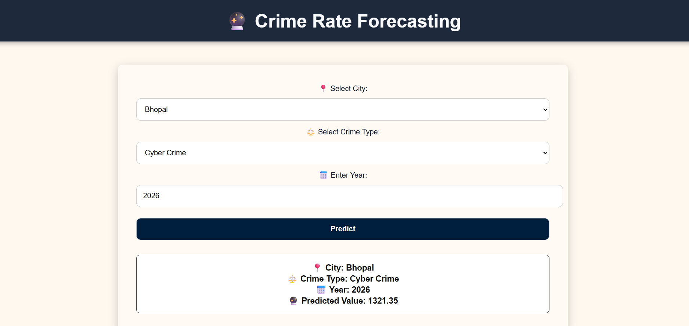

# 🔮 Crime Rate Forecasting Web Application

## 📖 Overview
This project is a **Machine Learning-powered web application** that forecasts crime rates for different cities and crime categories.  
Using historical crime datasets (2015–2024), the system predicts future crime counts (e.g., 2025–2027) with the help of **Random Forest Regressor** and **XGBoost Regressor** models.  

The app provides an easy-to-use **web interface** where users can select a city, crime type, and year to get real-time predictions.  
This tool can support **public safety planning, resource allocation, and policy making** by analyzing crime trends.

---

## 🚀 Features
- Predicts **crime counts** for selected city, crime type, and year.  
- Combines predictions from **Random Forest** and **XGBoost** for better accuracy.  
- Provides APIs for predictions, city list, and crime types using **FastAPI**.  
- Simple and responsive **frontend** with HTML, CSS, and JavaScript.  
- Stores data in **CSV files** (no external database required).  

---

## 🛠️ Tech Stack
**Backend:**
- Python, FastAPI, Uvicorn  
- Scikit-learn, XGBoost, Pandas, NumPy, Joblib  

**Frontend:**
- HTML, CSS, JavaScript  

**Data Storage:**
- CSV files (`full_data.csv`, `future_years.csv`)  

---
